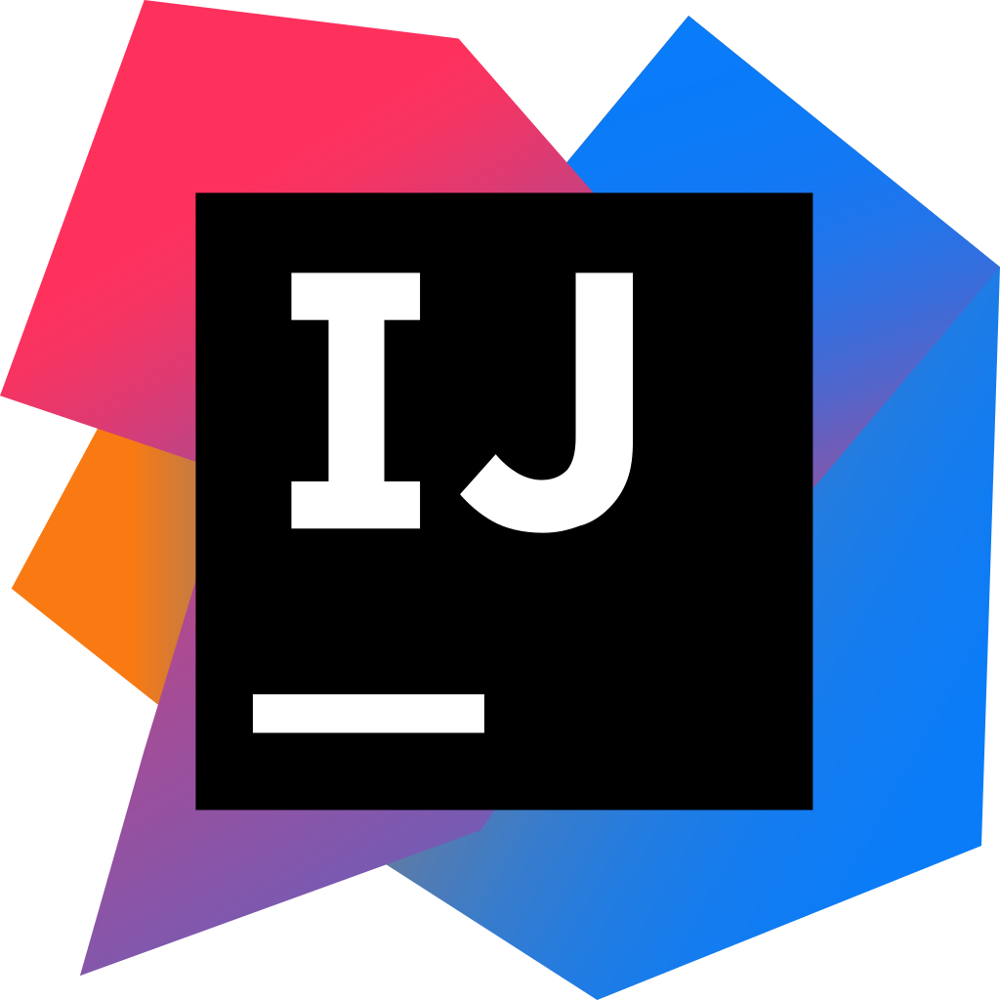

## `HI There,`👋

### I'm Afraz, currently an O'Level student. I love watching animes and reading mangas, random storybooks, encyclopedias and books on programming. I also like maths, physics and chemistry alot. Computer science and programming is the center of my interest.
-----

### `Programming Languages:`
  
    

-----

### `Query Languages:`

-----

### `Web Dev:` 
    
----

### `Tools(IDE/Editor):`
  

----

## `Thanks for visiting` 👋
